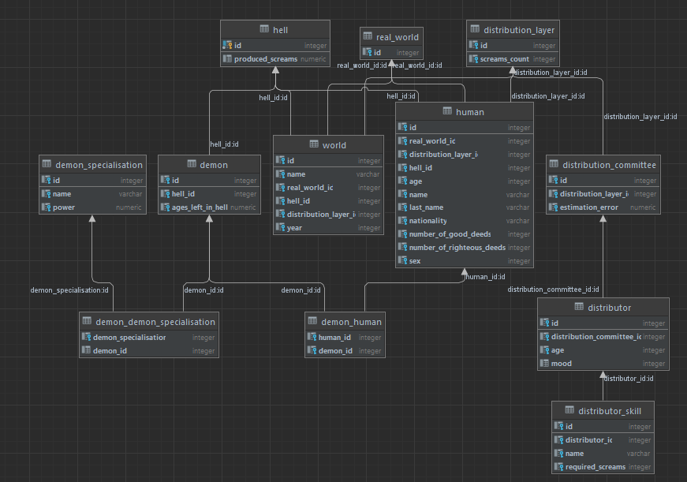
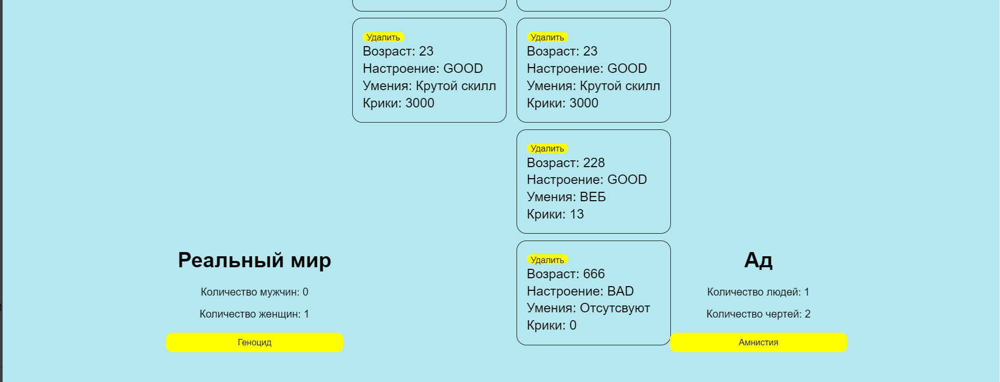

# DemonService

## Coursework Information

This project is a **Database Management Course** coursework assignment that demonstrates the implementation of a complex distributed system with database management principles. The application simulates an afterlife distribution system with multiple interconnected entities and business processes.

## Tech Stack

### Backend (Server)
- **Java 11** - Programming language
- **Spring Boot 2.7.4** - Application framework
- **Spring Data JPA** - Data persistence layer
- **Spring Data JDBC** - Database access
- **PostgreSQL** - Primary database
- **Liquibase** - Database migration tool
- **Lombok** - Code generation
- **ModelMapper** - Object mapping
- **SpringDoc OpenAPI** - API documentation (Swagger)
- **Gradle** - Build tool
- **Docker & Docker Compose** - Containerization

### Frontend (Client)
- **React 18.2.0** - Frontend framework
- **TypeScript** - Type-safe JavaScript
- **Axios** - HTTP client
- **React Router DOM** - Client-side routing
- **CSS Modules** - Component-scoped styling
- **Storybook** - Component documentation
- **ESLint** - Code linting
- **Prettier** - Code formatting
- **Stylelint** - CSS linting
- **Webpack** - Module bundler (via react-scripts)

### Development Tools
- **Docker Compose** - Database containerization
- **Gradle Wrapper** - Build automation
- **npm** - Package management
- **Git** - Version control

## Project Description

### Domain Overview
The percentage of atheists on the planet increases every year, but few people realize the existence of a post-mortem distribution system through which they will most likely end up in HELL.

After death, all souls, regardless of gender, sexual preferences, gender identity, and other irrelevant factors, enter the longest queue in the world. At the end of the queue awaits a distribution system commission. Its composition is practically unchanged and is updated exclusively by divine forces. Commission members require nothing for their work except the screams of sinners being tortured by demons.

The main task of the distribution system is to count the number of sinful and righteous deeds performed during the last life period to classify the soul. After classification, the soul is either sent back to the ordinary world (possibly in a different form) or to hell, where it will be distributed among several demons.

Each demon is created to humiliate sinners and has its own specialization, which it receives upon creation. Every sinner can become a demon after a certain amount of time. After several years in hell, demons gain the right to reincarnation and are sent to the ordinary world.

The planet's population is replenished through redistributed and newborn souls. Each year, three events are possible: several souls died, several souls were born, and several souls were redistributed back to the ordinary world.

#### Life in the Ordinary World
A certain number of people initially live in the ordinary world. They die every year, thereby reducing the population. Some of the deceased people return to the ordinary world after going through the distribution queue.

A demographic crisis in the ordinary world does not occur because every year each woman in a pair with a man gives birth to people.

During reincarnation and birth, people are assigned random characteristics that affect their further behavior in hell and the ordinary world (particularly gender).

Additionally, every year each living person commits sinful and righteous deeds that will be considered after their death during distribution (each righteous and sinful deed has its own weight).

If the human population grows too much, divine forces can organize genocide based on one or several human characteristics.

#### Distribution System
The distribution system consists of two elements: a queue of deceased people and a distribution commission. Divine forces can decrease and increase the number of distributors (while distributors receive random characteristics for evaluating the sinfulness and righteousness of the deceased).

Each distributor consumes "ory" (energy) created by sinners being tortured by demons. If distributors don't have enough ory, they have a nervous breakdown, and the entire queue, regardless of the ratio of sins to righteous deeds, is sent to HELL.

Each year, one distributor evaluates one deceased person and sends them where they deem appropriate.

Additionally, each distributor possesses unique skills that require sinner ory.

#### Life in Hell
After entering hell, a person becomes a sinner and, depending on their level of sinfulness, is humiliated by n-number of demons. If a person ended up in hell due to distributor nervous breakdown, only one demon humiliates them.

After a certain period, some sinners become demons, and some demons reincarnate into the ordinary world.

Each humiliated sinner produces ory that feeds the distributors. The more demons humiliate a sinner, the more ory they produce.

If a divine entity considers demons who should be reincarnated soon as worthy, they can grant them early amnesty and send them to the ordinary world.


### Business Processes Implemented by the Application

1. **Divine Forces Business Processes:**
   - Increasing the number of distributors
   - Decreasing the number of distributors
   - Conducting genocide in the ordinary world
   - Granting amnesty to demons in hell

2. **Ordinary World Business Processes:**
   - Death of random people
   - Birth of people from woman-man pairs
   - Reincarnation of people from hell or the distribution system
   - Committing sinful and righteous deeds by living people

3. **Distribution System Business Processes:**
   - Distribution of deceased based on their sinfulness-to-righteousness ratio
   - Distribution of deceased to hell during distributor stress
   - Consumption of sinner ory by distributors

4. **Hell Business Processes:**
   - Becoming a sinner
   - Assignment of demons to sinners
   - Becoming a demon from sinner
   - Redistribution of demons for reincarnation
   - Production of ory by sinners

### Project Structure

- ***server*** - Server-side application
  - *resources* - Meta-information for project startup
  - *config* - Filter configuration
  - *controllers* - MVC controllers
  - *dto* - Data structures transmitted via HTTP
  - *entity* - Data structures describing database entities
  - *exceptions* - Custom exceptions
  - *repository* - JPA repositories
  - *service* - Application service layer
  - *interfaces* - Service interfaces
- ***client*** - Directory containing the client-side application
  - *public* - Static files compiled into React application
  - *api* - Module containing interaction with service API
  - *components* - React components used in the application
  - *context* - React application context description
  - *atom* - Atomic components
  - *panels* - Application pages
  - *types* - Types for API and internal application
  - *styles* - Global styles

### API Structure

### Initial Database Structure


### Startup Script
```bash
# Start the database
cd ./server
docker-compose up

# Build and run the server
./gradlew bootRun

# Start the client (in a new terminal)
cd ../client
npm i
npm start
```

## Planned Changes

### Stage 1. Client-side Application Refactoring ✅
1. ✅ TypeScript added to application components
2. ✅ ESLint and Prettier added for unified code style
3. ✅ Stylelint added for unified CSS code style
4. ✅ Project structure changed and named exports added:
   1. *components* - Smart components (composed of atomic ones)
   2. *panels* - Application pages
   3. *atom* - Atomic components
   4. *api* - Interaction with server-side API
   5. *types* - Types for API and internal application
   6. *context* - React application context
5. ✅ Application footer grid changed

6. ✅ Unnecessary logging removed

### Stage 2. Server-side Application Refactoring ✅
1. ✅ API brought into compliance with REST Name Convention
2. ✅ Controller files changed
3. ✅ Client-side changed according to new API
4. ✅ Database changed:
   1. ✅ DemonSpecialization entity removed
   2. ✅ Demon entity changed
5. ✅ CORS policy changed to more secure
6. ✅ Interfaces added for services
7. ✅ Application configuration translated to YAML
8. ✅ Distributor sorting added on client

### Stage 3. Application Documentation Creation ✅
1. ✅ Swagger UI added for API
2. ✅ Storybook added for atomic components used in frontend
3. ✅ README files for each part of the application filled with correct information
4. ✅ Comments added to main parts of the application
