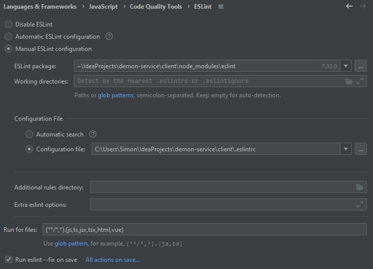
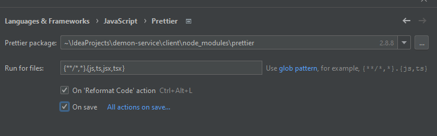
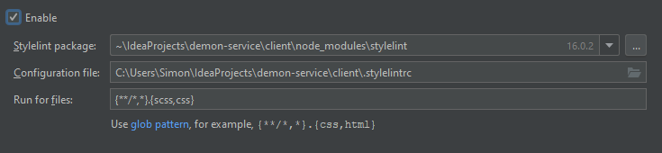

# Клиентская часть приложения 

## Структура проекта
1. ***components*** - умные компоненты (составлены из атомарных)
2. ***panels*** - страницы приложения
3. ***atom*** - атомарные компоненты
4. ***api*** - взаимодействие с API серверной части
5. ***types*** - типы для API и внутри приложения
6. ***context*** - контекст React приложения
7. ***styles*** - глобальные стили

В App.tsx подключаются глобальные стили и инициализируется контекст

## Настройка линтеров для WebStorm
1. Установите зависимости через ```npm i```
2. Зайдите во вкладку настроек Eslint и включите следующую конфигурацию:\

3. Зайдите во вкладку prettier и установите следующую конфигурацию:\

4. Зайдите во вкладку stylelint и установите следующую конфигурацию:\

5. Для ручного запуска eslint & prettier или stylelint используйте соотвествующую команду:
```
npm run lint:fix
npm run lint:styles:fix
```


## Скрипт запуска приложения
- Установка зависимостей: ```npm i```
- Запуск в режиме разработчика: ```npm start```
- Сборка приложения: ```npm run build```

## Скрипт запуска StoryBook
- Установка зависимостей: ```npm i```
- Запуск в режиме разработчика: ```npm run storybook```
- Сборка StoryBook: ```npm run build-storybook```

#### Сборка проекта осуществляется через react-scripts (webpack)
